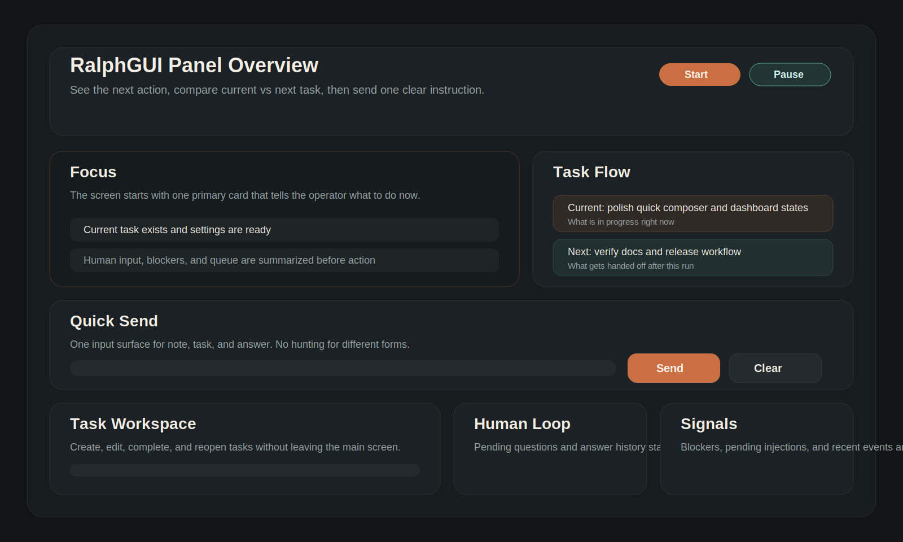

<p align="center">
  
</p>

<h1 align="center">RalphLoop</h1>

<p align="center">
  <strong>AI エージェントを自動で回し続ける、汎用オーケストレーション・ループ</strong><br/>
  Claude · Codex · Gemini · Qwen · Ollama — <code>stdin</code> で prompt を受ける CLI なら何でも OK
</p>

<p align="center">
  <a href="#-クイックスタート">クイックスタート</a> ·
  <a href="#-使い方">使い方</a> ·
  <a href="#-web-panel">Web Panel</a> ·
  <a href="#-コマンド一覧">コマンド一覧</a> ·
  <a href="./README.en.md">English</a>
</p>

---

## ✨ RalphLoop とは

RalphLoop は **AI コーディングエージェントの実行を自動化する CLI ツール**です。

```
prompt を渡す → エージェントが実装 → 結果を記録 → 次のタスクへ
```

この「ループ」を繰り返すことで、人が付きっきりにならなくても AI に開発を任せられます。

**主な特長:**

- 🔄 **自動ループ** — タスクリストに沿って何度でも自動実行
- 🌐 **Web Panel** — ブラウザから状態確認・タスク管理・質問への回答
- 🤖 **エージェント非依存** — `stdin` で prompt を受ける CLI なら何でも使える
- 💬 **止まらない運用** — エージェントが質問しても loop を止めず、次ターンで回答を注入
- 📋 **タスク管理** — 仕様書や PRD から一括タスク登録、優先順位の並び替え

---

## 🚀 クイックスタート

> **必要なもの:** Node.js 24+

```bash
git clone https://github.com/404-nan/ralph-loop.git
cd ralph-loop

cp .env.example .env
npm run check        # 設定チェック
./ralph demo         # デモモードで動作確認
```

ブラウザで **http://127.0.0.1:8787** を開くと Panel が表示されます。  
デモでは疑似エージェントが質問 → 回答 → 完了の流れを体験できます。

---

## 📖 使い方

### 1. 設定

`.env` を編集して、使いたいエージェントを設定します。

```bash
# 使うエージェントのコマンド
RALPH_AGENT_COMMAND=codex exec --full-auto --skip-git-repo-check

# 作業ディレクトリ
RALPH_AGENT_CWD=.

# prompt テンプレート
RALPH_PROMPT_FILE=prompts/supervisor.md
```

#### エージェント設定例

| エージェント | コマンド |
|:--|:--|
| Codex | `codex exec --full-auto --skip-git-repo-check` |
| Claude Code | `claude --dangerously-skip-permissions` |
| Gemini CLI | `gemini --yolo` |
| Qwen Code | `qwen` |

> **💡 Tip:** `stdin` を受けないエージェントでも、小さなラッパースクリプトで対応できます。
>
> ```bash
> #!/usr/bin/env bash
> PROMPT="$(cat)"
> your-agent --prompt "$PROMPT"
> ```

### 2. タスクを用意

Panel から手動追加するか、JSON ファイルで一括登録できます。

```json
{
  "userStories": [
    {
      "id": "US-001",
      "title": "ログイン画面を実装する",
      "priority": 1,
      "acceptanceCriteria": ["メールとパスワードでログインできる"]
    }
  ]
}
```

> 1 タスク = 1 回の実行で完了できるサイズが理想です。  
> 詳細: [docs/task-catalog.md](./docs/task-catalog.md)

### 3. 実行

```bash
./ralph              # サービス起動（Panel + Supervisor）
```

あとは Panel を開いて、進捗を見守るだけです。

---

## 🌐 Web Panel

Panel は「今なにが起きているか」をひと目で把握するためのダッシュボードです。

| できること | 説明 |
|:--|:--|
| 📊 ダッシュボード | 現在のタスク・進捗・ログをリアルタイム表示 |
| ✏️ タスク管理 | 作成・編集・並び替え・完了・差し戻し |
| 💬 質問への回答 | エージェントの質問にその場で回答 |
| 📄 仕様書インポート | README / PRD を貼り付けてタスクを一括登録 |
| ⚙️ 設定変更 | ランタイム設定をブラウザから変更 |
| ▶️ 実行制御 | start / pause / resume / abort |

---

## 📋 コマンド一覧

```bash
./ralph              # サービス起動（= ./ralph start）
./ralph demo         # デモモードで動作確認
./ralph run "タスク名"    # 起動と同時に 1 回実行
./ralph status       # 現在の状態を表示
./ralph check        # 設定の診断
./ralph reset        # state/ と logs/ を初期化
./ralph configure    # 設定変更（--max-iterations, --cwd など）
```

> `npm link` すれば `ralph` コマンドとしてどこからでも使えます。

---

## 🐚 最小モード（ralph.sh）

Panel なしのシンプルな bash ループだけ使いたい場合:

```bash
./ralph.sh "codex exec --full-auto" 20
./ralph.sh "gemini --yolo" 20
```

---

## 🔗 Discord 連携

`.env` に Discord Bot の token を設定すると、通知や操作を Discord から行えます。

```bash
RALPH_DISCORD_TOKEN=your-bot-token
RALPH_DISCORD_NOTIFY_CHANNEL_ID=channel-id
RALPH_DISCORD_ALLOWED_USER_IDS=your-user-id
```

> 詳細な設定項目は [.env.example](./.env.example) を参照してください。

---

## 📚 ドキュメント

| ドキュメント | 内容 |
|:--|:--|
| [English README](./README.en.md) | English version |
| [Architecture](./ARCHITECTURE.md) | 内部構造 |
| [Task Catalog Guide](./docs/task-catalog.md) | タスク定義の詳細 |
| [Minimal Example](./examples/minimal/README.md) | 最小サンプル |
| [Contributing](./CONTRIBUTING.md) | コントリビューション |
| [Changelog](./CHANGELOG.md) | 変更履歴 |

---

## 🧪 開発者向け

```bash
npm run lint         # リント
npm test             # テスト
npm run smoke        # スモークテスト
npm run build        # ビルド
```

---

<p align="center">
  <strong>MIT License</strong> · Made with 🤍 by <a href="https://github.com/gakkoumc">LuL AI</a>
</p>
